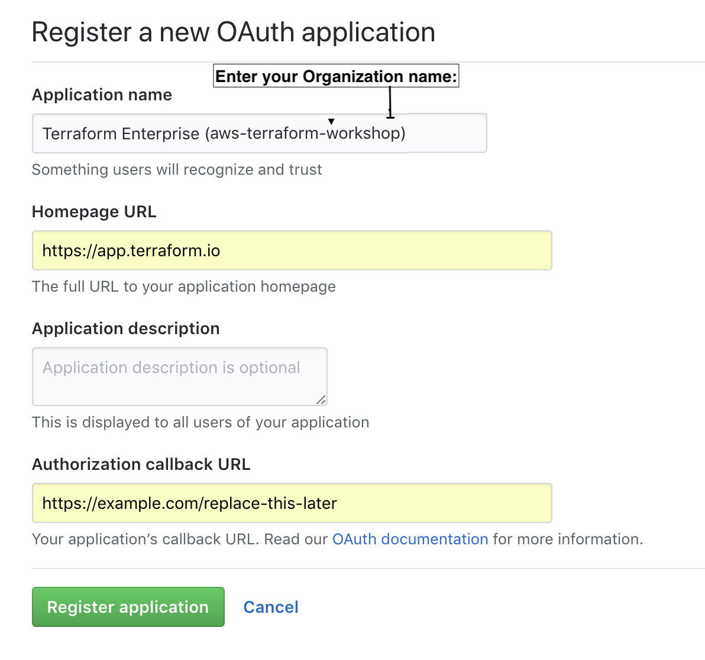
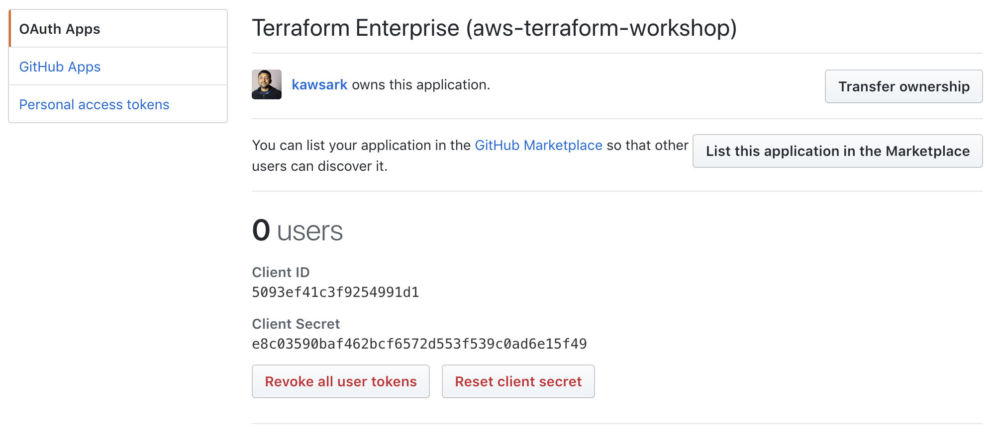
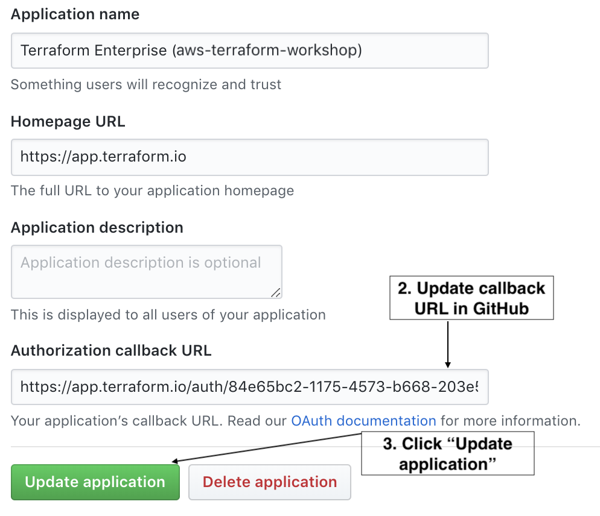
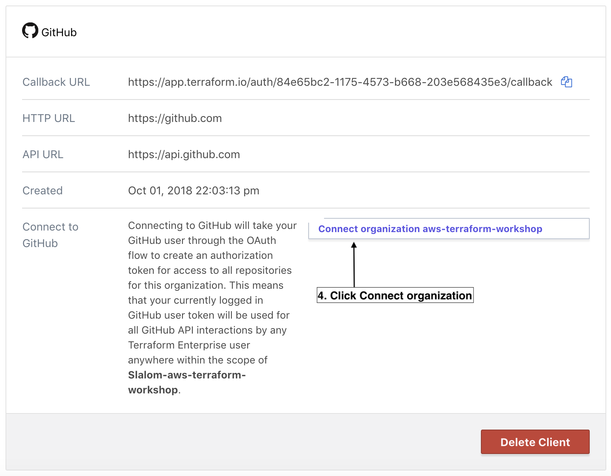
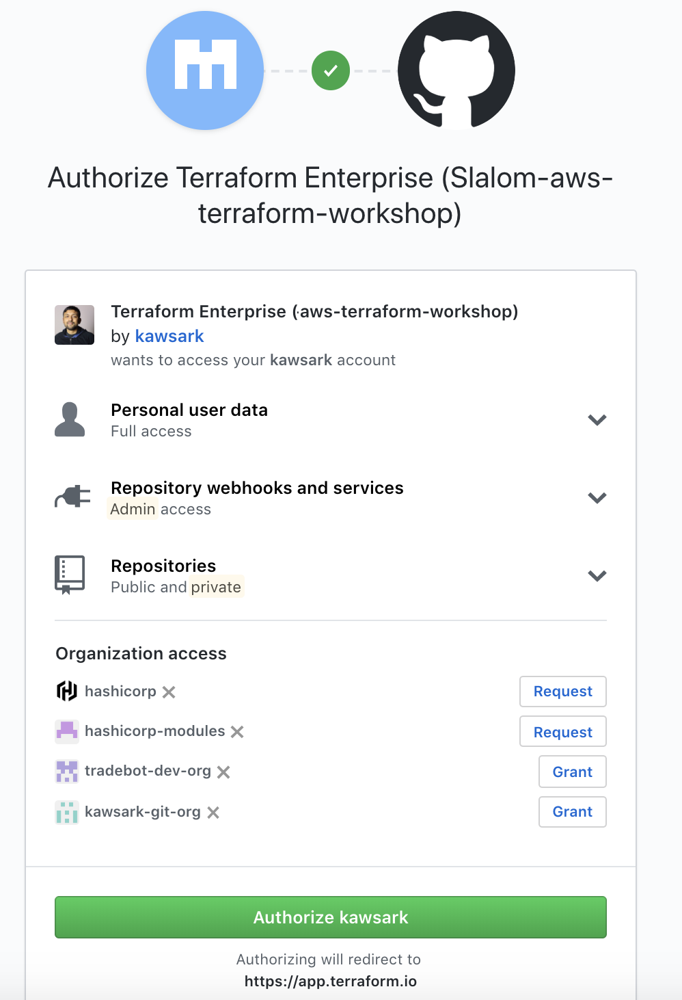
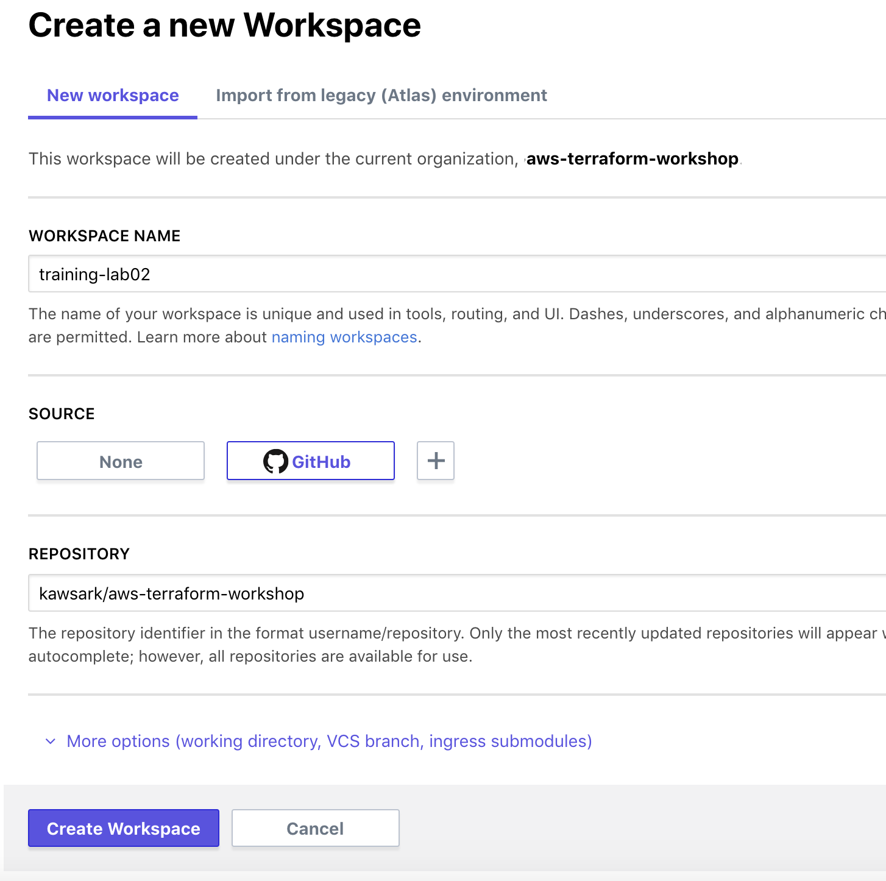
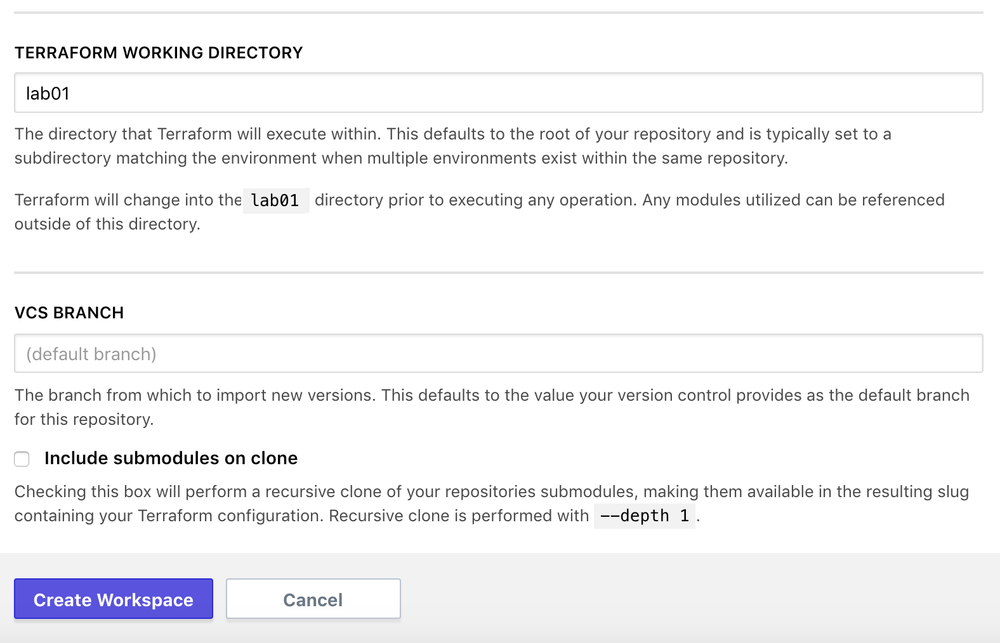
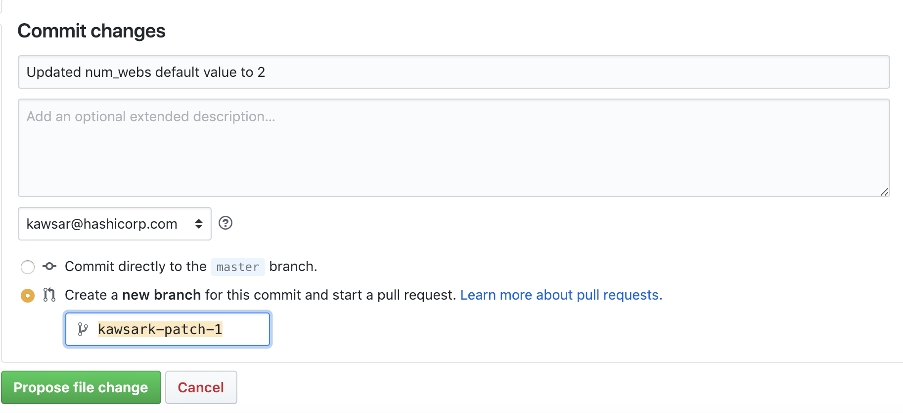
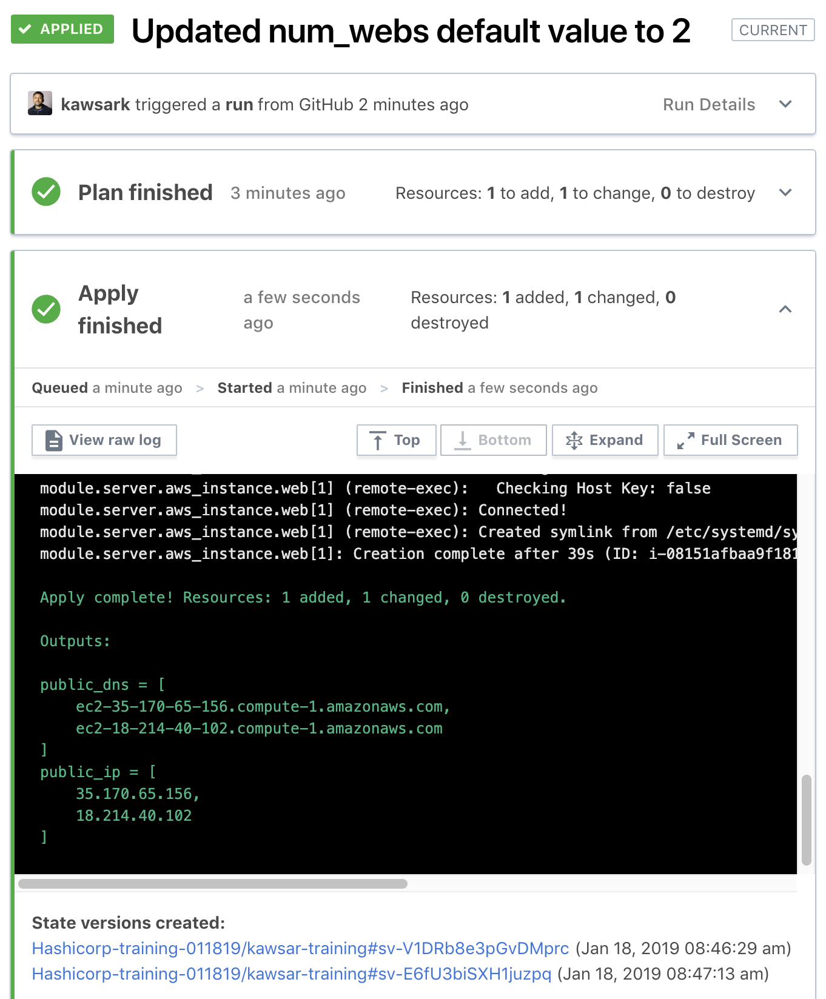

## VCS integration with Terraform Enterprise

Duration: 45 minutes

This lab demonstrates how to connect Terraform Enterprise to a source code management system (GitHub) and create a Workspace that can apply the Terraform configuration when changes are committed. This is called a [VCS-driven run workflow](https://www.terraform.io/docs/enterprise/run/ui.html).

To perform this Lab you will create a new account in [Terraform Enterprise trial account](https://app.terraform.io/account/new), and create your own Organization within Terraform Enterprise.

This lab is for use with a student's own AWS credentials and is intended to run on Terraform Enterprise. HashiCorp training students will be provided with Lab AWS credentials.

The Terraform configuration in this directory will provision one or more AWS EC2 instances and deploy an example Go application. To install the application, Terraform will generate a RSA SSH public and private key pair by Terraform using the Terraform [tls_private_key](https://www.terraform.io/docs/providers/tls/r/private_key.html) provider.

**Notes:**
- This branch is for use with a student's own AWS credentials and is intended to run on Terraform Enterprise
  - Note: This lab can also be run locally, see [local.md](local.md) for steps.
- In this branch a RSA public and private key pair will be generated by Terraform using the Terraform [tls_private_key](https://www.terraform.io/docs/providers/tls/r/private_key.html) provider. This will be used for SSH access.

**Tasks:**
- Task 1: Connect GitHub to TFE and Fork a GitHub Repo
- Task 2: Configure Variables
- Task 3: Queue a Plan
- Task 4: Confirm and Apply the Plan
- Task 5: Scale the application using a Git workflow
- Task 6: Destroy provisioned infrastructure

### Terraform Enterprise

Pre-requisites:
- An AWS account with IAM user credentials: `AWS_ACCESS_KEY_ID` and `AWS_SECRET_ACCESS_KEY`
- Access to a Terraform Enterprise Server. This Lab will use the hosted SaaS version on [app.terraform.io](https://app.terraform.io), attendees will be provided a trial account.
- A [GitHub](https://github.com/) account.


### Task 1: Connect GitHub to TFE and Fork a GitHub Repo

Using a GitHub repository will allow us to use source control best practices on our infrastructure configs.

Populating variables to Terraform Enterprise will give Terraform Enterprise our AWS credentials so it can run Terraform on our behalf.

Connecting Terraform Enterprise to GitHub will give us a continuous integration style of workflow for managing infrastructure.

#### Step 1.1: Fork the repo

Visit this GitHub repository and fork it so you have a copy in your own GitHub account:

    https://github.com/kawsark/aws-terraform-workshop.git

Optionally, clone the repository to your local machine (if you prefer to edit code locally instead of in the browser).

```bash
$ git clone https://github.com/$USER/aws-terraform-workshop.git
```

#### Step 1.2: Connect GitHub to TFE

Please go to [https://app.terraform.io](https://app.terraform.io) and create a new Organization, or Navigate to an Organization you created earlier. The URL format is: `https://app.terraform.io/app/<your-organization-name>`

- Go to [GitHub](https://github.com/settings/profile) and find your Settings page, accessed from the menu on your avatar.

- At the bottom of the settings page is **"Developer Settings."** Click that. Now you’ll see a list of OAuth Apps. Click the **"New OAuth App"** button.

- Fill them in as follows:
  - Application Name	Terraform Enterprise (<YOUR ORGANIZATION NAME>)
  - Homepage URL	https://app.terraform.io (or the URL of your private TFE install)
  - Application Description	Any description of your choice.
  - Authorization callback URL	https://example.com/replace-this-later (or any placeholder; the correct URI doesn't exist until the next step.)



- You’ll need the **Client ID** and **Client Secret** from the resulting page. Leave the page open and copy the **Client ID** to your clipboard.



- Now go back to Terraform Enterprise. Go to your OAuth Configuration by clicking the downward facing arrow by your organization’s name and choosing "Organization Settings." You’ll See "OAuth Configuration."

- Paste in the copied Client ID and Client Secret from GitHub. Scroll down and click the button to "Create OAuth Client."

- Now we finally have a "GitHub Callback URL" to use! Copy it from Terraform Enterprise and we’ll take it back to GitHub.


- Back at GitHub, scroll down and paste the URL into "Authorization Callback URL." Save the form.



- We’re almost done. Back at Terraform Enterprise, click the purple "Connect Organization" button. You'll see an authorization screen at GitHub. Click to approve.





- Back at Terraform Enterprise, you’ll see that it’s connected.

**NOTE:** For full capabilities, you can add your private SSH key which will be used to clone repositories and submodules. This is important if you use submodules and those submodules are in private repositories. That isn’t the case for us so I’ll leave that up to you.

### Step 1.3: Create a workspace in TFE

Finally, we’re ready to fully create a Terraform Enterprise workspace. Go to https://app.terraform.io and click the **"New Workspace"** button at the top right.

Give it a name such as "training-lab02".

- Choose GitHub as VCS connection.
- Click the "Repository" field and you’ll see a list of available repositories in an auto-complete menu. Find the `aws-terraform-workshop` repo. If yours isn’t here, refresh the page.



- Click the "More Options" link
  - **TERRAFORM WORKING DIRECTORY:** By default Terraform will use repository root directory. In this case we will specify: `lab01`.

  - **VCS BRANCH:** Terraform Enterprise can deploy from any branch. We'll use the default branch; alternatively you can specify `master`.



- Click the **Create Workspace** button.

You’ll see a screen showing that a Terraform Enterprise workspace is connected to your GitHub repository. But we still need to provide Terraform with our secret key, access key, and other variables defined in the Terraform code as variables.

## Task 2 - Task 4

Please complete Tasks 2 to Task 4 from Lab 1. These steps are identical.

## Task 5: Scale the application using a Git workflow

Edit the [variables.tf](../lab01/variables.tf) file in GitHub repo to update the `num_webs` default variable value from 1 to 2. You'll make a pull request with these changes and observe the status of the pull request on GitHub.

### Step 5.1

- Navigate to `main.tf`. Find the pencil icon. Click to edit this file directly in the browser.
  - Note: Although we are using the GitHub UI to edit this file, you may choose to edit `main.tf` locally and use the Git CLI to push to a new branch.


- **Append** the code below in `main.tf`

```bash
module "server-us-east-2" {
  source = "./server"
  region       = "us-east-2"
  num_webs     = "${var.num_webs}"
  identity     = "${var.identity}-us-east-2"
  ami          = "${lookup(var.ami, "us-east-2")}"
  ingress_cidr = "${var.ingress_cidr}"
}

output "public_dns_us_east_2" {
  value = "${module.server-us-east-2.public_dns}"
}
```
- Scroll to the bottom and select the option to "Create a new branch and start a pull request."


- You’ll be taken to a screen to create a pull request. Click the green "Propose file change" button. The page will be pre-populated with your commit message. Click "Create pull request."



- After a few seconds, you'll see that Terraform Enterprise checked the plan and that it passed.


- To see what was checked, click "Show all checks" and click "Details" next to the line that says "Terraform plan has changes."

- Merge the pull request to the `master` branch with the big green "Merge pull request" button. Click the "Confirm merge" button.

## Task 5: Confirm and Apply the Plan

### Step 5.5.1: Confirm and `apply`

- Back at Terraform Enterprise, find the "Current Run" tab. Click it and you’ll see the merge commit has triggered a plan and it needs confirmation.

- Scroll to the bottom of the run and confirm the `plan`. At the bottom of the page you’ll see a place to comment (optional) and click **"Confirm & Apply."** This will queue a `terraform apply`.

Examine the output of `apply` and find the DNS address of the new instance. Copy any of the IP addresses and paste it into your browser. You'll see the running web application.



## Task 6: Destroy

To clean up, destroy the infrastructure you've just created.

### Step 6.1: Configure CONFIRM_DESTROY variable

Go to the "Settings" tab in Terraform Enterprise and scroll to the bottom. Note the instructions under "Workspace Delete." We want to destroy the infrastructure but not necessarily the workspace.

You'll need to create an environment variable (not a Terraform variable) named `CONFIRM_DESTROY` and set it to `1`.

Go to the "Variables" tab and do that.


Click "Add" and "Save".

### Step 6.2: Queue destroy plan

It's sometimes necessary to queue a normal plan and then queue the destroy plan.

At the top of the page, click the "Queue Plan" button. The plan will run and detect that no changes need to be provisioned.

Now go back to the "Settings" tab. Scroll to the bottom and click "Queue Destroy Plan." Note the messages under "Plan" that indicate that it will destroy several resources.

Click "Confirm and Apply." After a few seconds, your infrastructure will be destroyed as requested.
